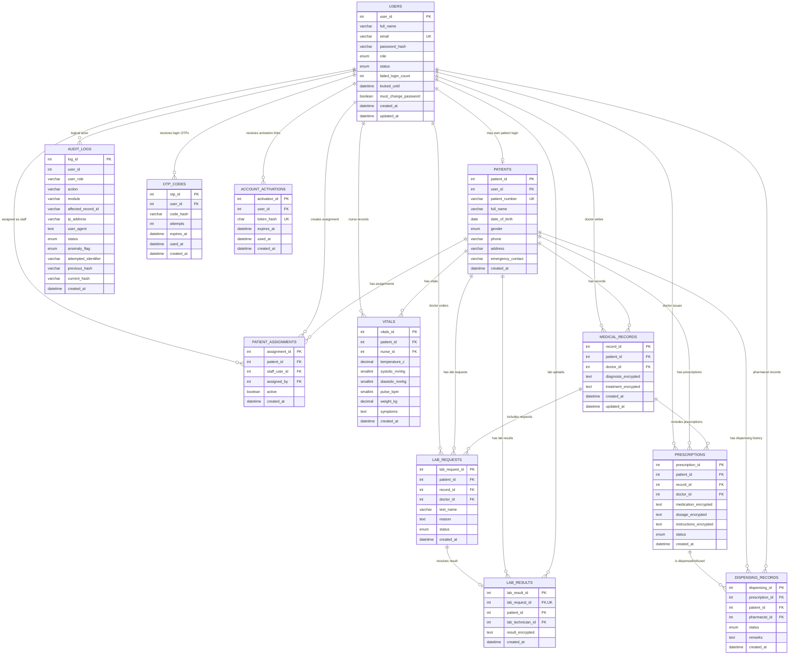

# MediShield Entity Relationship Diagram

This ERD is generated from `sql/schema.sql` and the current migrations. It shows
the core healthcare workflow, authentication/verification tables, and the
tamper-evident audit log used by MediShield.

## Relationship Notes

- `users` stores all login-capable actors: patients, nurses, doctors, lab staff,
  pharmacists, and admins.
- `patients.user_id` is optional because a patient demographic record can exist
  with or without a patient login account.
- `patient_assignments` controls object-level access by linking patients to
  assigned nurses/doctors and recording the admin who created the assignment.
- Clinical data flows from `patients` into `vitals`, `medical_records`,
  `lab_requests`, `lab_results`, `prescriptions`, and `dispensing_records`.
- Sensitive clinical payloads are encrypted at rest in the encrypted text
  columns for diagnoses, treatments, lab results, medications, dosages, and
  prescription instructions.
- `otp_codes` and `account_activations` store only hashes of verification secrets,
  never plaintext OTPs or activation tokens.
- `audit_logs.user_id` is treated as a logical link to `users`, but the schema
  intentionally does not declare a foreign key so historical forensic logs can
  survive account deletion or changes.
